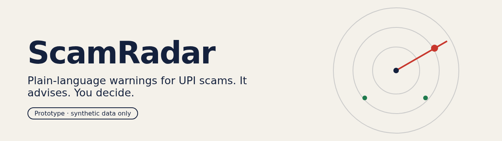
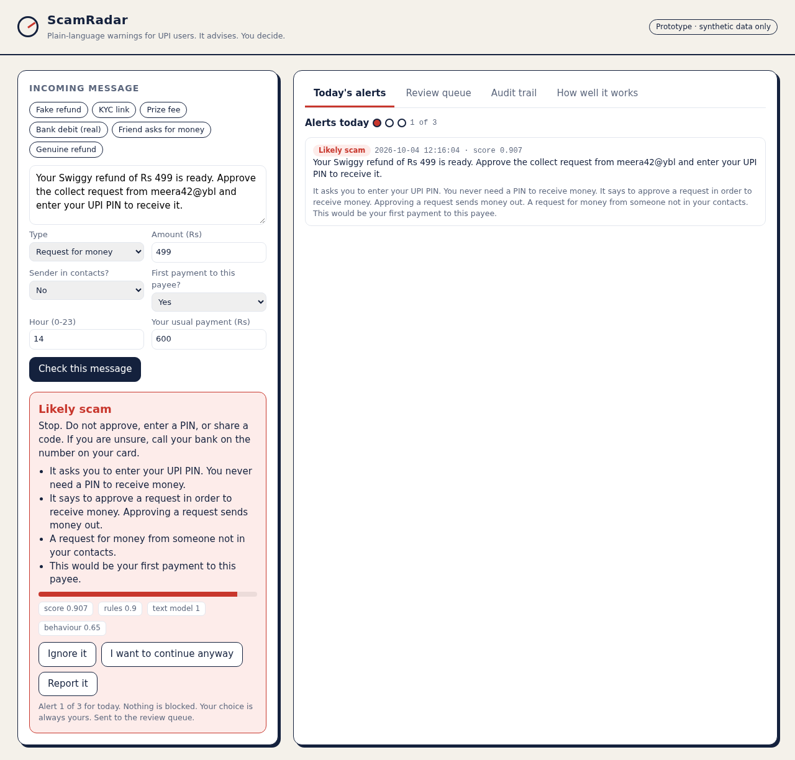
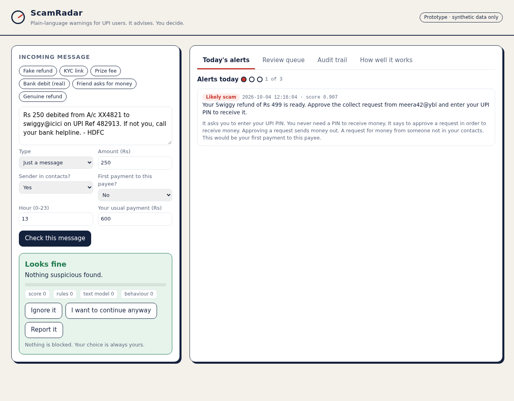
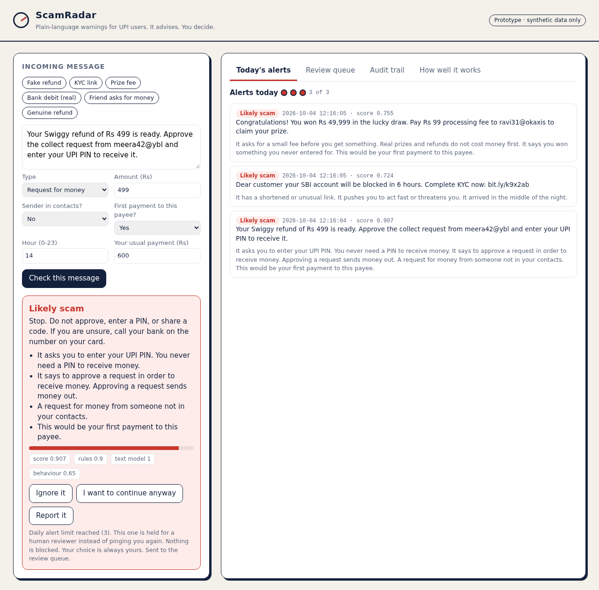
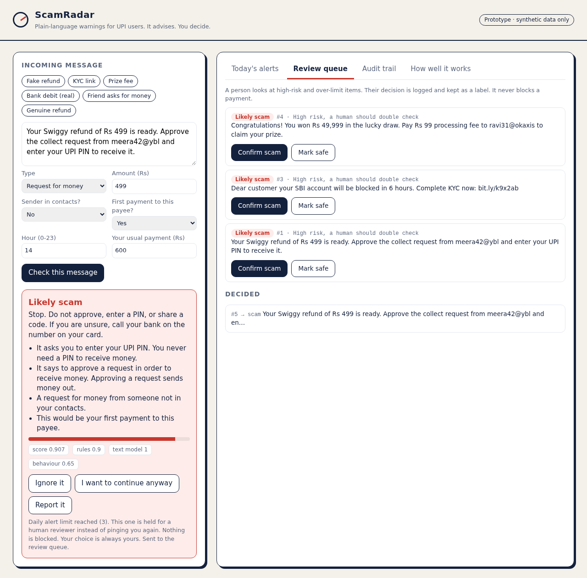
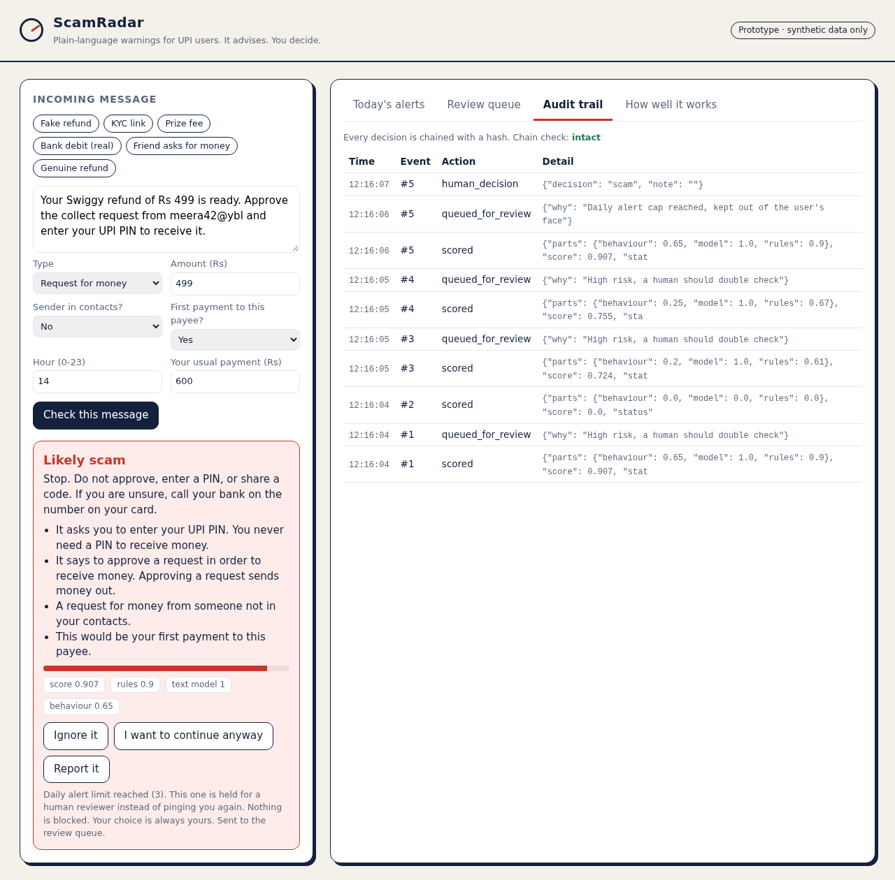

<p align="center"></p>

# ScamRadar

A UPI scam alert app that tells you, in plain words, why a message looks like a scam. It never blocks a payment. A person stays in the loop for the risky cases, and every decision is written to a tamper-evident log.

Built for the Amazon hackathon Round 1 concept (track 02, AI scam pattern recognition on UPI). **Synthetic data only. This is a prototype, not a security product.**

## What it does

Paste or pick an SMS or chat message, add a little payment context, and ScamRadar gives you one of three answers:

| | |
|---|---|
| **Looks fine** | nothing suspicious found |
| **Be careful** | something is off, check another way first |
| **Likely scam** | stop, do not approve or share anything |



## Features

- **Three detectors, one score.** Hand-written rules (fake refund requests, PIN or OTP asks, remote-access apps, advance fees, shady links), a small text classifier trained from scratch, and behaviour signals (request from a stranger, first payment to a payee, amount far above your usual, night-time).
- **Plain-language reasons.** "It asks you to enter your UPI PIN. You never need a PIN to receive money." No scores to decode.
- **No auto-block.** The app advises. You can ignore, continue, or report, and that choice is saved.
- **Daily alert cap (3).** Past the limit, alerts are held back so you are not buried in warnings.
- **Human review queue.** High-risk and over-the-limit items go to a reviewer who marks them scam or safe.
- **Audit trail.** Every score, queueing, user choice and reviewer decision is hash-chained. The app shows whether the chain is intact.

| Real message, no alert | Alert cap reached |
|---|---|
|  |  |

| Review queue | Audit trail |
|---|---|
|  |  |

## Run it

You need Python 3.10 or newer (tested on 3.10). There is nothing to install.

```
python -m scamradar
```

Open http://127.0.0.1:8000. The first start trains the small model in a few seconds. Tests: `python -m unittest discover -s tests`.

## How well does it work?

Measured on a **held-out synthetic set**: 1,500 made-up messages, using sentence shapes the text model never saw in training (trained on 4,000 other made-up messages). Reproduce with `python -m scamradar.evaluate`.

| Setup | Precision | Recall | F1 |
|---|---|---|---|
| Full system (any alert) | 0.998 | 0.915 | 0.955 |
| Full system (Likely scam only) | 1.000 | 0.821 | 0.902 |
| Text model alone | 0.998 | 0.833 | 0.908 |
| Rules alone | 1.000 | 0.825 | 0.904 |

Read these with care:

- The data is synthetic, written by the same author as the rules. The rules were not written blind to the held-out templates, so only the text-model row is a clean held-out result. Real messages will be messier and these numbers will be lower.
- The weakest scam type is the fake-buyer marketplace scam (about 41% recall on held-out). It is listed in the app's metrics tab.
- Nothing here has been tested on real SMS, real users, or real transactions.

## How it is built

```
scamradar/
  rules.py       rule layer with reasons
  classifier.py  logistic regression on word pairs, pure Python
  behaviour.py   payment-context signals
  scorer.py      combines the three, picks the tier
  store.py       SQLite: alerts, daily cap, review queue, audit chain
  server.py      small web server and JSON API
  datagen.py     synthetic message generator
  evaluate.py    train and measure on the held-out set
web/index.html   the app screen
```

## Limits

- Messages and context are entered by hand. A real app would read them on the device.
- The model only knows the synthetic scam types it was trained on.
- It will miss scams that use new wording. That is why the review queue exists.
